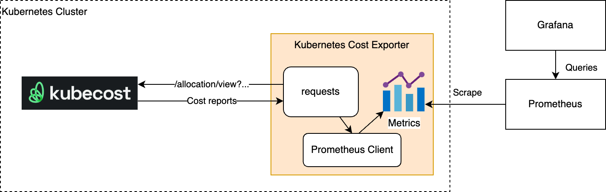

# Kubernetes Cost Exporter

With the help of [AWS Cost Explorer](https://aws.amazon.com/aws-cost-management/aws-cost-explorer/), engineers are able to analyze the cost of their AWS such as Managed Kubernetes Service (EKS). However, AWS Cost Explorer does not provide the fine-grained granularity of cost information for EKS clusters, such as namespace-level costs (see https://github.com/aws/containers-roadmap/issues/2018). In the current situation, engineers usually set up a third-party framework for collecting such cost data. Kubecost is one of such nice products and is also [recommended by AWS](https://aws.amazon.com/blogs/containers/aws-and-kubecost-collaborate-to-deliver-cost-monitoring-for-eks-customers/).

However, Kubecost or other similar tools usually have their own cost management dashboards and APIs. Engineers need to check this cost information in another place than their common monitoring dashboard. Kubernetes Cost Exporter provides a standard way for exposing cost information as Prometheus metrics, which can be used by any monitoring platforms such as Grafana and Datadog.

## Sample Output

```
# HELP kubernetes_daily_cost_usd Kubernetes daily cost in USD aggregated by namespace
# TYPE kubernetes_daily_cost_usd gauge
kubernetes_daily_cost_usd{namespace="ingress"} 0.9518491293125411
kubernetes_daily_cost_usd{namespace="ns1"} 1.6744666615442327
kubernetes_daily_cost_usd{namespace="ns2"} 0.7495529489062231
kubernetes_daily_cost_usd{namespace="ns3"} 1.0655696937099663
kubernetes_daily_cost_usd{namespace="kube-system"} 1.1914006049581642
...
```

*ps: As the metric name indicate, the metric shows the daily costs in USD. `Daily` is based a fixed 24h time window, from UTC 00:00 to UTC 24:00. `namespace` is a label based on `--aggregate` option. Users can also add custom labels using the `--label` option.*


## How Does This Work

The current implementation fetches cost information from [Kubecost](https://github.com/kubecost) via its API `/allocation/view`. Though Kubecost exposes cost metrics like `node_cpu_hourly_cost`, it requires extra calculation to get a detailed cost report like namespace-level costs. By using its API `/allocation/view`, the calculated cost reports can be directly exposed as Prometheus metrics. The arguments that are used for calling this API include:

| Parameter | Description                                                    | Value                              |
| --------- | -------------------------------------------------------------- | ---------------------------------- |
| aggregate | Level of aggregation                                           | configurable, namespace or cluster |
| window    | Period of time over which the cost is calculated               | today                              |
| shareIdle | Whether idle resources should be shared with other allocations | true                               |

The following figure briefly shows the design of Kubernetes Cost Exporter.


## Deploy Kubecost

In our case, all the Kubernetes clusters are deployed in AWS EKS. We follow [this blog post](https://aws.amazon.com/blogs/containers/aws-and-kubecost-collaborate-to-deliver-cost-monitoring-for-eks-customers/) to deploy Kubecost to each EKS first. You can also install Kubecost as an AWS EKS add-on via AWS CLI or AWS console. Detailed instructions can be read [here](https://docs.kubecost.com/install-and-configure/install/provider-installations/aws-eks-cost-monitoring#deploying-kubecost-on-amazon-eks-cluster-using-amazon-eks-add-on).

No matter what way is used for installing Kubecost, as long as the Kubecost service can be reached within the Kubernetes cluster, you can proceed to the next step.

## Deploy Kubernetes Cost Exporter

The Kubernetes Cost Exporter needs to be deployed to the same cluster where the Kubecost has been installed. We provide a sample Kubernetes `deployment.yaml` that deploys the exporter. Modify the `deployment.yaml` file in folder `deployment/k8s` according to the comments in that file, and then run the following command.

```
kubectl create --namespace <NAMESPACE> -f ./deployment/k8s/deployment.yaml
```